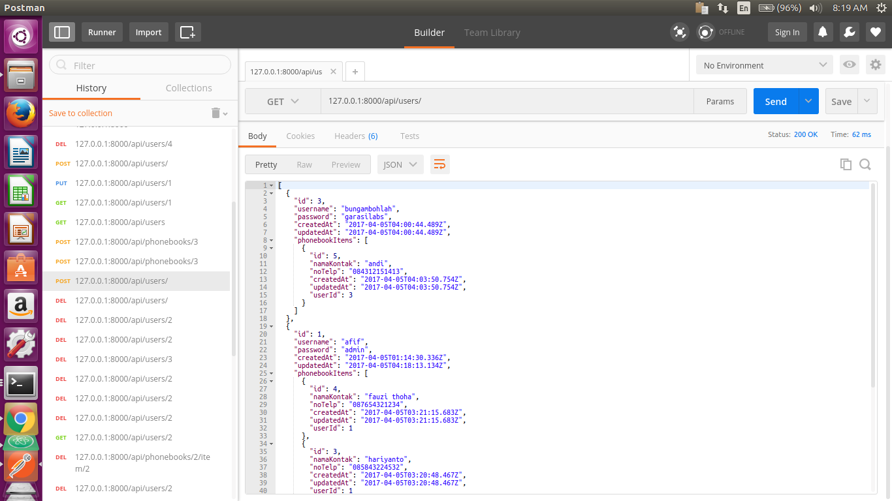

# Onboarding CRUD Phonebook


Aplikasi Phonebook ini dibuat dengan menggunakan framework [`Express`](http://expressjs.com/) beserta webserver [`nodemon`](https://nodemon.io/) (nodeJS). Jenis database yang digunakan adalah [`postgresql`](https://www.postgresql.org) dengan bantuan ORM (Object Relational Mapping) [`Sequelize`](http://sequelizejs.com).


## Instalasi Aplikasi


### Clone project ini, lalu install dependency packages.


```sh
$ npm install
```


disarankan atau direkomendasikan instalasi secara global agar command app pada node berjalan sempurna.


```sh
$ npm install -g
```


### Mengatur Konfigurasi Database


Install `postgresql` pada komputer server anda, dengan menggunakan command `apt-get` atau sejenisnya. Untuk penggunaan linux dapat menggunakan command ini :


```sh
$ sudo apt-get install postgresql-9.4
```

Jika tidak dapat menggunakan versi `9.4` dapat menggunakan `9.5`

```sh
$ sudo apt-get install postgresql-9.5
```


Lalu konfigurasi database pada username dan password `postgresql`.
Dan buat database menggunakan nama `phonebook` atau lainnya.


```sh
$ CREATE DATABASE phonebook
```


Lalu migrasi model-model yang ada pada folder `/server/migrations/` ke postgres menggunakan module `pg` dari `Node Package`


```sh
$ npm install -g sequelize-cli


$ sequelize db:migrate
```


Dengan catatan install `sequelize-cli` secara global


### Atur konfigurasi pada aplikasi


Atur konfigurasi aplikasi pada `./server/config/config.json` pada section `development` dan `test` sesuai opsi pengaturan `postgresql` anda.


### Running webserver dengan command :


```sh
$ npm run start:dev
```


port yang digunakan pada webserver yakni 8000, anda juga bisa mengganti port sesuai keinginan anda pada konfigurasi `./bin/www`.


## Penggunaan Aplikasi


Aplikasi ini berjalan secara `REST API` pada route `/api` dengan response header application type `JSON` dengan menggunakan package `body-parser` secara default. Pada halaman depan '/' akan memunculkan plain text html


Terdapat 2 bagian data yakni data User dan Data daftar kontak, dimana satu User dapat menggunakan banyak Kontak.


Untuk menerapkan sistematis melewati API dapat menggunakan aplikasi pembantu pada extensi Chrome Apps, yakni [Postman](https://chrome.google.com/webstore/detail/postman/fhbjgbiflinjbdggehcddcbncdddomop)
, dan jalankan [Postman](https://chrome.google.com/webstore/detail/postman/fhbjgbiflinjbdggehcddcbncdddomop) .


### Menambah Data User


method yang digunakan adalah POST pada URL http://localhost:8000/api/users/ pada bagian parameter body request di isi dengan username dan password


### Menampilkan semua data User


method yang digunakan adalah GET pada URL http://localhost:8000/api/users. Maka akan menampilkan semua data dengan daftar kontak pada masing-masing User





### Menampilkan spesifik data User


method yang digunakan adalah GET dengan parameter URL, contoh: http://localhost:8000/api/users/1 , maka akan menampilkan data user dengan ID 1


### Mengubah spesifik data User


method yang digunakan adalah PUT dengan parameter URL, contoh: http://localhost:8000/api/users/1 dengan menggunakan parameter data body request username dan password, maka akan mengubah data sesuai ID User tersebut.


### Menghapus spesifik data User


method yang digunakan adalah DELETE dengan parameter URL, contoh http://localhost:8000/api/users/1, maka akan menghapus data pada database dengan ID 1.


### Menambah Data phonebook


method yang digunakan adalah POST dengan parameter URL userId dan parameter body namaKontak dan noTelp, contoh : http://localhost:8000/api/phonebooks/1, maka akan menambah data phonebooks pada user dengan ID 1


### Mengubah data phonebook

Method yang digunakan adalah PUT dengan dua parameter URL: userId dan idPhonebook, dan juga menggunakan parameter request data body namaKontak dan noTelp, contoh: http://localhost:8000/api/phonebooks/1/item/2 /, maka akan mengubah data phonebooks pada ID 2 dan id User 1.


### Menghapus data phonebook


Method yang digunakan adalah DELETE dengan dua parameter URL :  userId dan :idPhonebook, contoh: http://localhost:8000/api/phonebooks/1/item/2/ , maka akan menghapus data phonebooks pada ID 2 dan id User 1.


## Copyright


Copyright 2017 [PT. garasilabs](https://garasilabs.com)
